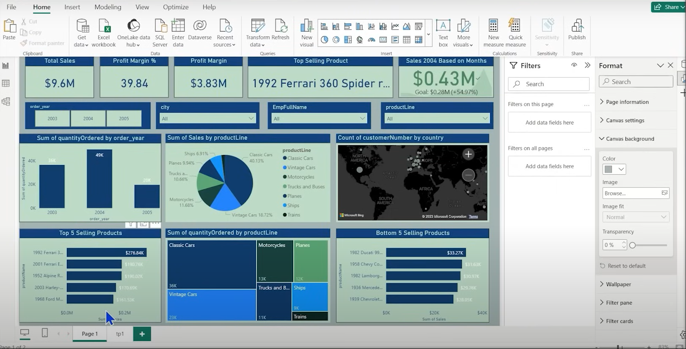

🚀 Sales Analytics Dashboard
Power BI | Interactive | Data-Driven Decision Making

  

🔍 Overview
A dynamic Power BI dashboard transforming raw sales data into actionable business intelligence. Designed for sales managers, executives, and analysts to:

Track KPIs in real-time

Identify growth opportunities

Optimize product strategy

Monitor geographical performance

🛠️ Technical Stack
Component	Details
Tools	Power BI Desktop, Power Query, DAX
Data Modeling	Star schema with optimized relationships
Visualizations	Interactive charts, maps, and conditional formatting
Integration	Bing Maps API for geographical analysis
📊 Key Features
1. Interactive Visualizations
Visualization	Purpose
KPI Cards	Total Sales, Profit Margin (%), Profit Amount, Top Product
Geographical Map	Customer distribution by country (Bing Maps integration)
Time Analysis	Line/bar charts showing sales trends across years/quarters
Product Breakdown	Treemap and pie charts for sales by product line/category
2. Smart Filtering
Slicers: Year, City, Employee, Product Line

Cross-filtering: Click any visual to filter the entire dashboard

3. Performance Metrics
Goal tracking (e.g., 2004 sales exceeded targets by 54.97%)

Comparative analysis (YoY growth, top/bottom 5 products)

📈 Insights Highlight
Product Focus: Classic Cars dominate sales (40% share).

Regional Strength: 72% of customers in USA, Germany, and France.

Temporal Trend: Q4 consistently outperforms other quarters.

  

💡 Business Impact
✅ Strategic Decisions: Reallocate inventory based on product/country performance.
✅ Goal Setting: Historical trends inform realistic future targets.
✅ Efficiency: Reduce manual reporting time by 80%.

📥 Usage Guide
Open: Load .pbix file in Power BI Desktop.

Explore: Use slicers to filter data dynamically.

Share: Publish to Power BI Service for team collaboration.

🌟 Why This Dashboard?
User-Centric Design: Intuitive layout with consistent color themes.

Mobile-Ready: Responsive across devices.

Scalable: Modular design allows easy addition of new data sources.
